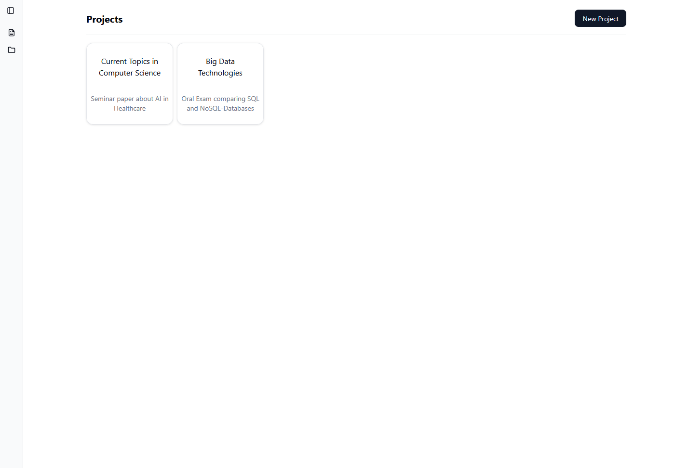
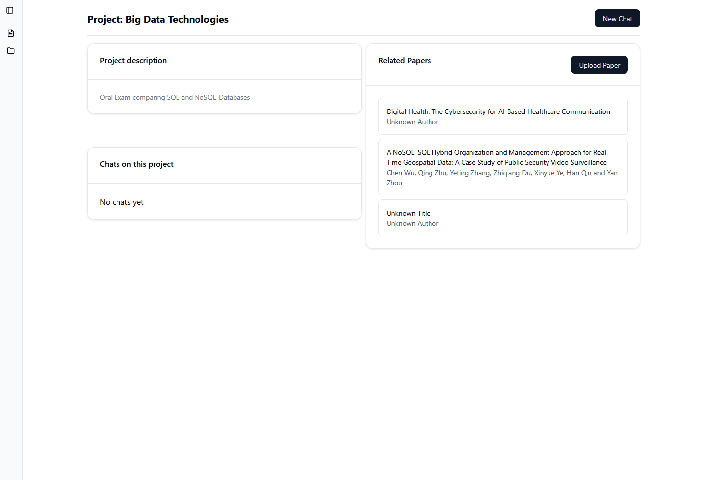

# PaperBuddy

Your digital writing buddy.

PaperBuddy helps students (currently: me) analyze, summarize, and write about academic papers by grounding LLM responses directly in uploaded source documents.
Under the hood, it uses a Postgres-backed RAG pipeline to embed, store, and retrieve paper chunks for grounded LLM responses.

Built with React, shadcn/ui, ASP.NET, and PostgreSQL with pgvector.

## About

This is a personal learning project to explore vector embeddings and RAG systems and learn to write some raw SQL on the way.  

### Status

Currently in a very early stage.

## How it works

1. Upload a paper
2. Paper text is chunked and embedded
3. Embeddings are stored in Postgres (pgvector)
4. Queries retrieve relevant chunks via vector similarity
5. LLM responses are grounded in retrieved content

## Prerequisites

- docker & docker compose
- deno
- .NET 8
- Ollama with `nomic-embed-text` + 'ollama3.1'

## Setup

Start database, api and ollama:

``` bash
./start-stack.sh
```

Start only database and ollama:

``` bash
./start-dev-stack.sh
```

Start frontend

``` bash
cd /src/frontend
```

``` bash
deno task dev
```

## Database Migrations

Migration scripts are found under `./script/migrations`. To run a migration use:

```bash
cd scripts
```

```bash
bash ./run-migration.sh <migration_file.sql>
```

## Roadmap & TODO List

### Main Features
- [x] **Paper Content Analysis**:
  - [x] Implement AI-powered summarization
  - [x] Save paper contents as embeddings for similarity search
- [ ] **Multi-Paper Chat**: Enable project-level chats that reference all associated papers (e.g., "Summarize findings from all papers in this project").
- [ ] **Citation Management**: Add auto-generation of citations (BibTeX, APA) and a reference tracker in the UI.
- [ ] **Thesis Writing Tools**: AI-assisted outline generation and draft prompts based on project content.

### Nice to haves:
- [ ] **User Authentication**: Add login/signup to save projects across sessions.
- [ ] **External Integrations**: Connect to arXiv/Semantic Scholar for paper fetching and metadata enrichment.

## Screenshots



