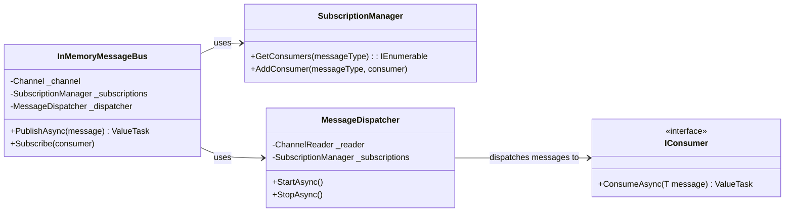

# Message Bus

```mermaid
classDiagram
    direction LR
    InMemoryMessageBus --> SubscriptionManager : uses
    InMemoryMessageBus --> MessageDispatcher : uses
    MessageDispatcher --> IConsumer : dispatches messages to

    class InMemoryMessageBus {
      -Channel<MessageEnvelope> _channel
      -SubscriptionManager _subscriptions
      -MessageDispatcher _dispatcher
      +PublishAsync(message) ValueTask
      +Subscribe<T>(consumer)
    }

    class SubscriptionManager {
      +GetConsumers(messageType) : IEnumerable<object>
      +AddConsumer(messageType, consumer)
    }

    class MessageDispatcher {
      -ChannelReader<MessageEnvelope> _reader
      -SubscriptionManager _subscriptions
      +StartAsync()
      +StopAsync()
    }

    class IConsumer {
      <<interface>>
      +ConsumeAsync(T message) ValueTask
    }
```