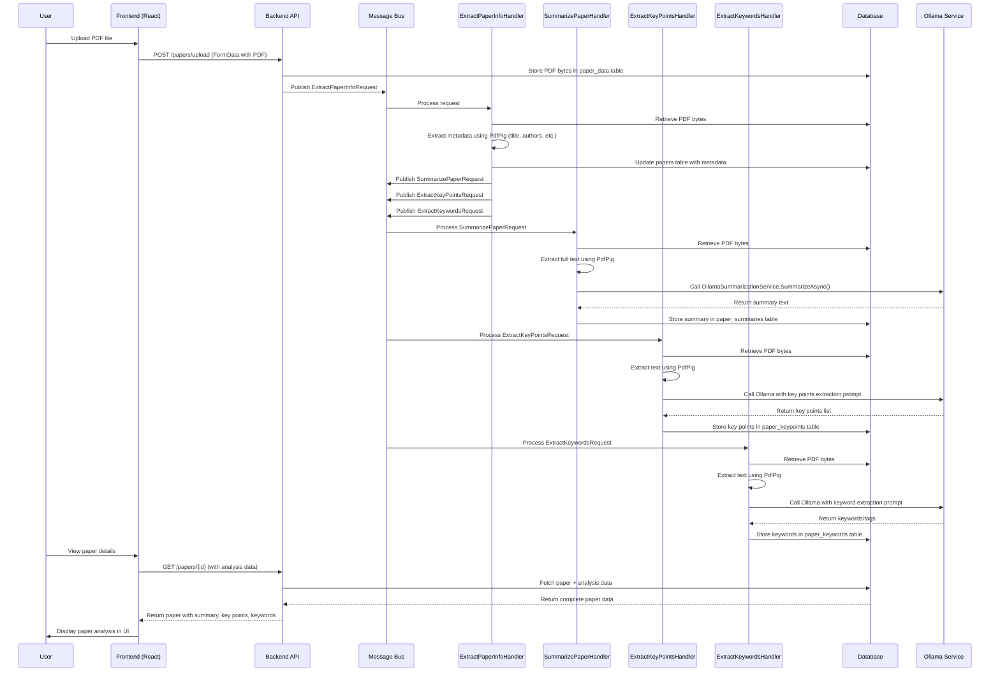

# Paper Content Analysis Flow

This document visualizes the sequence of events for AI-powered paper content analysis in PaperBuddy.

```mermaid
sequenceDiagram
    participant U as User
    participant FE as Frontend (React)
    participant API as Backend API
    participant MB as Message Bus
    participant EPH as ExtractPaperInfoHandler
    participant SPH as SummarizePaperHandler
    participant KPH as ExtractKeyPointsHandler
    participant KWH as ExtractKeywordsHandler
    participant DB as Database
    participant OS as Ollama Service

    U->>FE: Upload PDF file
    FE->>API: POST /papers/upload (FormData with PDF)
    API->>DB: Store PDF bytes in paper_data table
    API->>MB: Publish ExtractPaperInfoRequest
    MB->>EPH: Process request
    EPH->>DB: Retrieve PDF bytes
    EPH->>EPH: Extract metadata using PdfPig (title, authors, etc.)
    EPH->>DB: Update papers table with metadata
    EPH->>MB: Publish SummarizePaperRequest
    EPH->>MB: Publish ExtractKeyPointsRequest
    EPH->>MB: Publish ExtractKeywordsRequest

    MB->>SPH: Process SummarizePaperRequest
    SPH->>DB: Retrieve PDF bytes
    SPH->>SPH: Extract full text using PdfPig
    SPH->>OS: Call OllamaSummarizationService.SummarizeAsync()
    OS-->>SPH: Return summary text
    SPH->>DB: Store summary in paper_summaries table

    MB->>KPH: Process ExtractKeyPointsRequest
    KPH->>DB: Retrieve PDF bytes
    KPH->>KPH: Extract text using PdfPig
    KPH->>OS: Call Ollama with key points extraction prompt
    OS-->>KPH: Return key points list
    KPH->>DB: Store key points in paper_keypoints table

    MB->>KWH: Process ExtractKeywordsRequest
    KWH->>DB: Retrieve PDF bytes
    KWH->>KWH: Extract text using PdfPig
    KWH->>OS: Call Ollama with keyword extraction prompt
    OS-->>KWH: Return keywords/tags
    KWH->>DB: Store keywords in paper_keywords table

    U->>FE: View paper details
    FE->>API: GET /papers/{id} (with analysis data)
    API->>DB: Fetch paper + analysis data
    DB-->>API: Return complete paper data
    API-->>FE: Return paper with summary, key points, keywords
    FE->>U: Display paper analysis in UI
```
