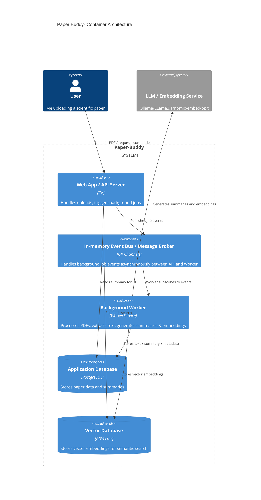
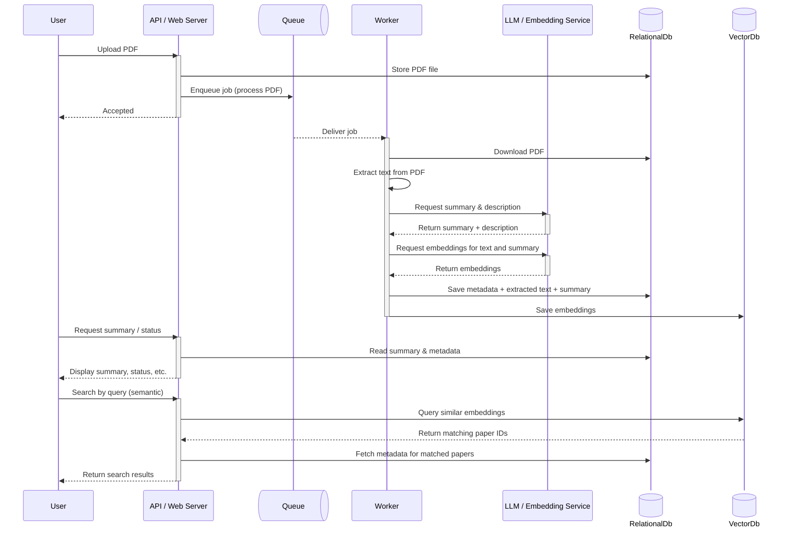

# Paper Buddy - Architecture Overview

# Purpose

A personal application for summarizing scientific papers. It allows uploading PDF papers, automatically extracts text, generates summaries and embeddings, and stores them for retrieval and semantic search.

### Core Application Components

#### **Web App / API Server**

**Technology:** ASP.NET WebApi with minimal endpoints

**Responsibilities:**

- Accepts PDF uploads.
- Enqueues background jobs for PDF processing.
- Returns processed summaries to the UI.
- Handles semantic search requests.

#### **In-Memory Event Bus**

**Technology:** C#, Channels

**Responsibilities:**

- Accept and enqueue Jobs
- Deliver jobs asynchronously to the background worker(s).
- Decouple the API from the worker, allowing the worker to process jobs at its own pace.

#### **Background Worker**

**Technology:** .NET BackgroundWorker

**Responsibilities:**

- Consumes jobs from the queue.
- Reads PDF metadata and contents from the database.
- Extracts text from PDFs.
- Calls the LLM service to generate:
  - Summaries
  - Description / metadata
  - Vector embeddings
- Stores extracted text and summaries back into the relational database.
- Stores vector embeddings into the vector database.

### Data Storage

#### **Relational Database**

**Technology:** PostgreSQL

**Responsibilities:**

- Stores paper metadata (title, author, upload timestamp).
- Stores the uploaded PDF file itself (as a `bytea` column).
- Stores extracted text from the PDF.
- Stores the generated summary and description.

#### **Vector Database**

**Technology:** PGVector

**Responsibilities:**

- Stores vector embeddings for semantic search.
- Enables similarity search across papers.

# C4 Container Diagram

# Sequence Diagram

