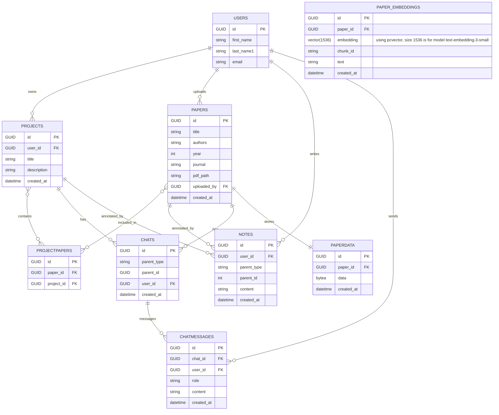

```mermaid
erDiagram
    USERS {
        GUID id PK
        string first_name
        string last_name1
        string email
    }
    PROJECTS {
        GUID id PK
        GUID user_id FK
        string title
        string description
        datetime created_at
    }
    PAPERS {
        GUID id PK
        string title
        string authors
        int year
        string journal
        string pdf_path
        GUID uploaded_by FK
        datetime created_at
    }
    PAPERDATA {
        GUID id PK
        GUID paper_id FK
        bytea data
        datetime created_at
    }
    PAPER_EMBEDDINGS {
        GUID id PK
        GUID paper_id FK
        vector(1536) embedding "using pcvector, size 1536 is for model text-embedding-3-small"
        string chunk_id
        string text 
        datetime created_at
    }
    PROJECTPAPERS {
        GUID id PK
        GUID paper_id FK
        GUID project_id FK
    }
    NOTES {
        GUID id PK
        GUID user_id FK
        string parent_type
        int parent_id
        string content
        datetime created_at
    }
    CHATS {
        GUID id PK
        string parent_type
        GUID parent_id
        GUID user_id FK
        datetime created_at
    }
    CHATMESSAGES {
        GUID id PK
        GUID chat_id FK
        GUID user_id FK
        string role
        string content
        datetime created_at
    }
    USERS ||--o{ PROJECTS : owns
    USERS ||--o{ PAPERS : uploads
    USERS ||--o{ NOTES : writes
    PROJECTS }o--o{ PROJECTPAPERS : contains
    PAPERS }o--o{ PROJECTPAPERS : included_in
    PAPERS ||--o{ NOTES : annotated_by
    PAPERS ||--o{ CHATS : has
    PROJECTS ||--o{ CHATS : has
    PROJECTS ||--o{ NOTES : annotated_by
    CHATS ||--o{ CHATMESSAGES : messages
    USERS ||--o{ CHATMESSAGES : sends
    PAPERS ||--|| PAPERDATA : stores
```