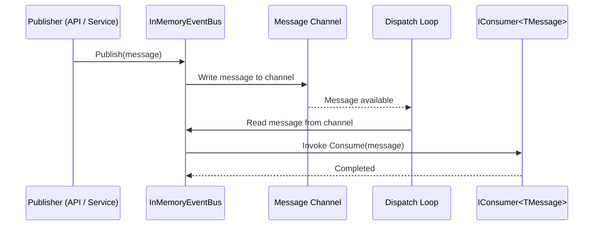

# PaperBuddy.MessageBus

A simple Bus implementation using Channels.

## Overview



## Usage

Registration:

```csharp
// Program.cs
servies.AddInMessageBus();
```

Implementing Consumers:

```csharp
internal sealed class ExampleConsumer : IConsumer<ExampleMessage>
{
    public Task ConsumeAsync(TMessage message)
    {
        // do stuff
    }   
}
```